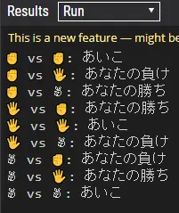

# はじめに

`if` を使わずにじゃんけんします。
じゃんけんの結果はC#8の機能の [switch式](https://docs.microsoft.com/ja-jp/dotnet/csharp/language-reference/operators/switch-expression) を使って受け取ります。
`switch式` であって `if文` ではないのでヨシ!

先駆者様

https://qiita.com/tadsan/items/65d91ba6b50535fc8815

[Qiita](https://qiita.com/AconCavy/items/b86b9e835a362795d33f)とのクロスポストです。

# 勝敗判定

じゃんけんのルールとして、`->` の右側が強いものとすると、 `Rock` -> `Paper` -> `Scissors` -> `Rock` の関係性が成り立ち、3つの手を周期として勝敗が決まっています。
ここで、`Rock` を0、`Paper` を1、`Scissors` を2として、関係性をそれぞれ1の距離を持った有効グラフだとすると、自分の手と相手の手の距離が1では負け、距離が2では勝ち、距離が0(3)ではあいこのような表現することができます。


このことから、`相手の手 - 自分の手` を計算することで距離を求めることができます。
しかし、自分の手が2で、相手の手が0だった場合、`0 - 2 == -2`のように、距離が負数になってしまいます。このとき、じゃんけんは3つの手を周期としているため、自分の手や相手の手を3つ移動させたところで手は変わらず、勝敗は変わりません。つまり、距離に3を足したり、3で剰余を取ったとしても勝敗は変わりません。このことから、`(相手の手 - 自分の手 + 3) % 3` とすることで、距離を0、1、2の3つにすることができ、負数と3以上になることを避けることができます。

# 実装

`Rps` (Rock-Paper-Scissors) クラスに `Hand` (グー、チョキ、パー) と `Result` (引き分け、負け、勝ち) の `enum` を定義することで、`Battle` 関数の引数と戻り値にそれぞれ意味を持たせます。

C#の `enum` は、既定値として `int` の0をとり、要素が増えるにつれて1増えます。そのため、この場合は、 `Rock (0)`、 `Paper (1)`、 `Scissors (2)` のようにそれぞれ値を持つことができます。

`Battle` 関数は、自分の手と相手の手を渡すことで、`Result.Draw`、 `Result.Lose`、 `Result.Win` のいずれかを返します。

```csharp
public static class Rps
{
    public enum Hand
    {
        Rock,
        Paper,
        Scissors
    }

    public enum Result
    {
        Draw,
        Lose,
        Win
    }

    public static Result Battle(Hand own, Hand opponent)
    {
        var result = ((int)opponent - (int)own + 3) % 3;
        return (Result)result;
    }
}
```

呼び出し側では、例に倣ってそれぞれの絵文字を割り当てます。
`switch式` を使うことで、`Battle` が返す可能性のあるパターンに、 `あいこ`、`あなたの負け`、`あなたの勝ち` を割り当て、一致した要素を `result` として受け、自分の手、相手の手と一緒に表示します。 `_ => throw new ArgumentOutOfRangeException()` では、対象となる値以外の値として判定された際に該当するアームになります。

```csharp
public static class Program
{
    public static void Main()
    {
        const string draw = "あいこ";
        const string win = "あなたの勝ち";
        const string lose = "あなたの負け";

        var map = new Dictionary<Rps.Hand, string>
        {
            [Rps.Hand.Rock] = "✊", [Rps.Hand.Paper] = "🖐", [Rps.Hand.Scissors] = "✌"
        };
        var hands = new[] { Rps.Hand.Rock, Rps.Hand.Paper, Rps.Hand.Scissors };

        foreach (var own in hands)
        foreach (var opponent in hands)
        {
            var result = Rps.Battle(own, opponent) switch
            {
                Rps.Result.Draw => draw,
                Rps.Result.Lose => lose,
                Rps.Result.Win => win,
                _ => throw new ArgumentOutOfRangeException()
            };
            Console.WriteLine($"{map[own]} vs {map[opponent]}: {result}");
        }
    }
}
```

# 実行結果



[sharplabでの実行結果](https://sharplab.io/#v2:C4LgTgrgdgPgAgJgIwFgBQcAMACOSAsA3OulAIYC2ApgM4AOZAxldgMplQAmARgPYAe6AN7psY3AgDMo8SLTiFEhDMXY5q1Y15QawXEhycwZAO7YAvNgBEgIQZAIgyBlBivF5GhVp168OEwEsoFtY2gFYMgPoMgHYMgLtKgIYMzipu2B66+jgANrw0LJa2YeGABTGAigxxaPFuAG5kYNgUZHSBUFRmACK+jMC+2pUAngA8AEp0NAB0ABIcnAA0KQB8pRrqCaoA2gPDY1xDfbyMANYAuoFWgFDkVlMrg6PjQwAKtVRgB9mAvBuACbun2OdrV6yMvjQ0vDANEe1kAMORWOaqAC+LkWYgqVQAFuMaPVGksDkJsKtLhstrspjj1pwbncwISLsShj8/gCgdgYSRXIsAGaAqhMRHYAAUCOwvBMAX82GRXBoAEpIYo2WAOYwubzKvy6HRtFQoHphaLOBKpQoFnDxHzZTQIKk9JYcQAhMjAYCpKjcgVQKa8FVqjXi7A0PzAeV6+YBxY4vq0M3AIZNYxmczTbBGUwTIMJENh81DAAyGSycfSmSTzMNilTpvTAHVhbHsH4Xcm3AB9Cxx4CIsAC7ANMwAQTAAHMINQNQB5CDAIcsvocXtUACi/GYdHa2m5ksLhsZa7heAAnNyACRWIQ1OhLZ17KHYMqoo+1U/uhoa88gNQm8NQqzi2FwqFSn+Fv/xHAkj6AAbBI2KDPEBqKEB2DqgO2DElK0FuPiOwFoatx0PcGFwjS/yAjQv5Mm4sHwRQ2JpsAyHJlGibJlm+bJhWUDESUm5iLBeBgaGpZ6DadoOtyxL8oKUwiW6qoPsAq5uChGjGlRgTcty/gyZJHp6AAtDyanis62AANTYJIXoAKQmV+ixwAA7DyvHhuKr7mlZih/gof5QkAA===)
