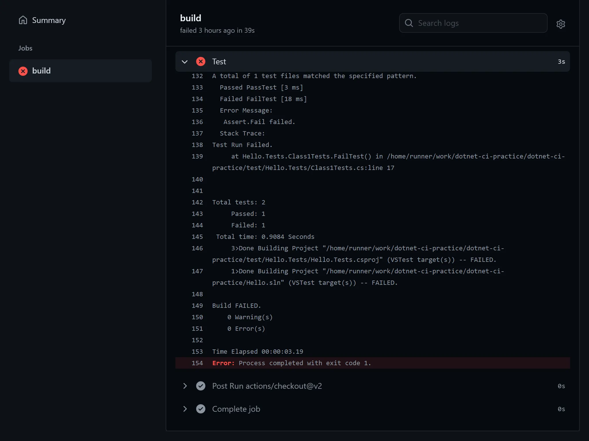
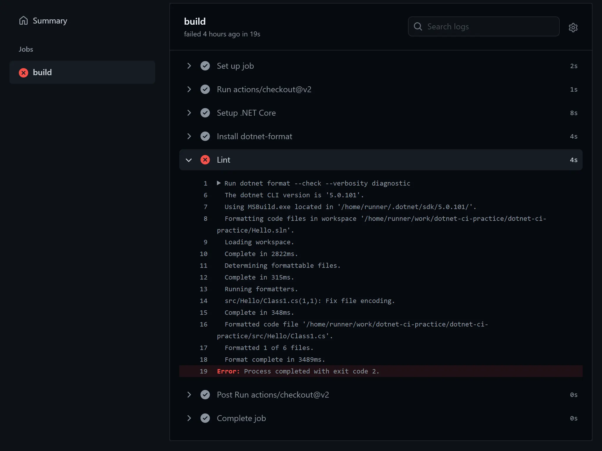
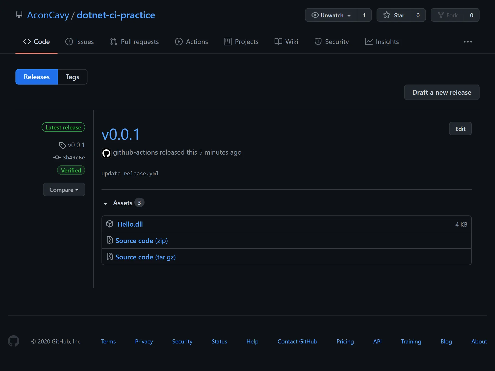

# これ何

リポジトリを作成したときにやっておくと後々楽になるかもしれないことをまとめたメモです。

# 開発環境ごとの差異をなくすために

開発者によってOSやエディタ等の開発環境が異なるのでルールを決めます。

## git config

WindowsとMacOS / LinuxではOSにより行の終端が異なるため、何も変更していないつもりでも、OSが異なるとdiffが発生してしまう場合があります。それを避けるために、Gitの設定でbranchをcheckoutしたときに、ファイルをどの形式で認識するかを設定します。

`core.autocrlf`を`true`にすると、ファイル形式が`CRLF`と`LF`のどちらであってもcheckout時に`CRLF`に変換され、commit時には自動的に`LF`へと変換されます。
また、`core.autocrlf`を`input`にすると、`LF`のままcheckoutとcommitが行われます。
そのため、Windowsでは`true`、MacOS / Linuxでは`input`を指定しておくといいでしょう。

- Windows

```powershell
git config --global core.autocrlf true
```

- Mac OS / Linux

```sh
git config --global core.autocrlf input
```

## .gitattributes

リポジトリ単位で行の終端処理を行う場合は、`.gitattributes`をリポジトリのルートに作成して設定を行うことで、`core.autocrlf`を設定していない開発者がいてもGitが自動的にファイルの終端を変更してくれます。

```
* text=auto
```

`.gitattributes`には[GitLFS](https://git-lfs.github.com/)の設定をすることもできるので、音声や画像、データセットなどの容量が大きなファイルはLFSの設定をするといいかもしれません。

その他詳しくは[こちら (GitHub Docs, 行終端を処理するようGitを設定する)](https://docs.github.com/ja/free-pro-team@latest/github/using-git/configuring-git-to-handle-line-endings)

## .gitignore

プロジェクトの生成物やエディタが生成するファイルなど、プロジェクトに関わりのないファイルやディレクトリを指定しましょう。

エディタの設定ファイルに関しては、リポジトリに開発者ごとのエディタ設定を無視させるのではなく、開発者自身が`.gitignore_global`を設定した方がいいかもしれません。

- Windows

```powershell
git config --global core.excludesfile core.excludesfile path/to/.gitignore_global
```

- MacOS / Linux

```sh
git config --global core.excludesfile core.excludesfile ~/.gitignore_global
```

## .editorconfig

エディタによってインデントのサイズやコードスタイルなどのフォーマットの設定が変わります。ファイルごとにバラバラなフォーマットが適用されてしまうことを避けるために[EditorConfig](https://editorconfig.org/)を利用して、フォーマットスタイルを統一させます。EditorConfigはJetbrainsのIDEやVisualStudio等のIDEでは標準で搭載しており、Visual Studio Codeなどのエディタでもプラグインをインストールすることで利用することができるようになります。

`.editorconfig`を作成し、エディタのフォーマット機能やEditorConfig対応のcliを利用することで、そのリポジトリのファイルを決まったルールでフォーマットすることができます。

```
root = true

# すべてのファイル
[*]
end_of_line = lf              # フォーマット時に終端をLFに変換 .gitattributesで指定してるならいらないかも
charset = utf-8
insert_final_newline = true   # ファイルの最後に改行
indent_style = space          # インデントはスペースで
indent_size = 4               # インデント4

# jsonとymlファイル
[*.{json, yml}]
indent_size = 2               # インデント2
...
```

# CI / CD

Unit Testや正しくファイルがフォーマットされているかのチェック、Releaseの作成、デプロイ等を自動化することによって、繰り返しの作業が楽になるので可能ならやっておきたいです。

以下dotnetのプロジェクトをGitHub ActionsでWorkflowを構築した場合の場合

## Unit test

GitHub Workflowの`.NET Core`を選択すれば必要最低限のWorkflowは実現できます。

リポジトリにコミットされた際にテストを実行し、一つでもテストが通らなかった場合は以下のように確認することができます。

```yml
name: Unit Test

on: [push, pull_request]

jobs:
  test:

    runs-on: ubuntu-latest

    steps:
    - uses: actions/checkout@v2
    - name: Setup .NET 5
      uses: actions/setup-dotnet@v1
      with:
        dotnet-version: 5.0.x
    - name: Install dependencies
      run: dotnet restore
    - name: Build
      run: dotnet build --configuration Release --no-restore
    - name: Test
      run: dotnet test --no-restore --verbosity normal
```



## Code format

EditorConfigを設定しているとdotnet toolの`dotnet-format`を使うことでEditorConfigに合ったファイルのフォーマットの確認ができます。

```sh
dotnet tool update -g dotnet-format
dotnet format --check
```

GitHub Workflowの`.NET Core`をベースにフォーマットを実行し、1つでもファイルがフォーマットされればWorkflowを失敗させるWorkflowを作成します。

```yml
name: Lint

on: [push, pull_request]

jobs:
  format:

    runs-on: ubuntu-latest

    steps:
    - uses: actions/checkout@v2
    - name: Setup .NET Core
      uses: actions/setup-dotnet@v1
      with:
        dotnet-version: 5.0.x
    - name: Install dotnet-format
      run: dotnet tool update -g dotnet-format
    - name: Lint
      run: dotnet format --check --verbosity diagnostic
```



# Releaseの作成

Releaseでは、Release用のTagがpushされたときに成果物をリポジトリのReleaseにアップロードします。次の例では.dllファイルをアップロードします。

```yml
name: Release

on:
  push:
    tags: 
    - 'v[0-9]+.[0-9]+.[0-9]+*' # v0.0.1のようなTagがpushされたとき

jobs:  
  release:
    runs-on: ubuntu-latest
    needs: [test]
    
    steps:
    
    # Build
    - uses: actions/checkout@v2
    - name: Setup .NET 5
      uses: actions/setup-dotnet@v1
      with:
        dotnet-version: 5.0.x
    - name: Build
      run: dotnet build -c Release
    
    # リリースを作成
    - name: Create Release 
      id: create_release
      uses: actions/create-release@v1
      env:
        GITHUB_TOKEN: ${{ secrets.GITHUB_TOKEN }}
      with:
        tag_name: ${{ github.ref }}
        release_name: ${{ github.ref }}
        # body |
        # hoge hoge # Releaseコメント
        draft: false
        prerelease: false

    # リリースの成果物にHello.dllを追加
    - name: Upload Release Asset
      id: upload-release-asset 
      uses: actions/upload-release-asset@v1
      env:
        GITHUB_TOKEN: ${{ secrets.GITHUB_TOKEN }}
      with:
        upload_url: ${{ steps.create_release.outputs.upload_url }}
        asset_path: ./src/Hello/bin/Release/net5.0/Hello.dll
        asset_name: Hello.dll
        asset_content_type: application/octet-stream # .dllファイルのcontent type
```

Workflowを実行すると次のようなReleaseが作成されます。



# まとめ

リポジトリを作った初めに設定を色々とやっておくと後々楽ができるかもしれません。
開発環境の差異をなくすための設定だけでもやっておくと混沌度が下がると思います。
